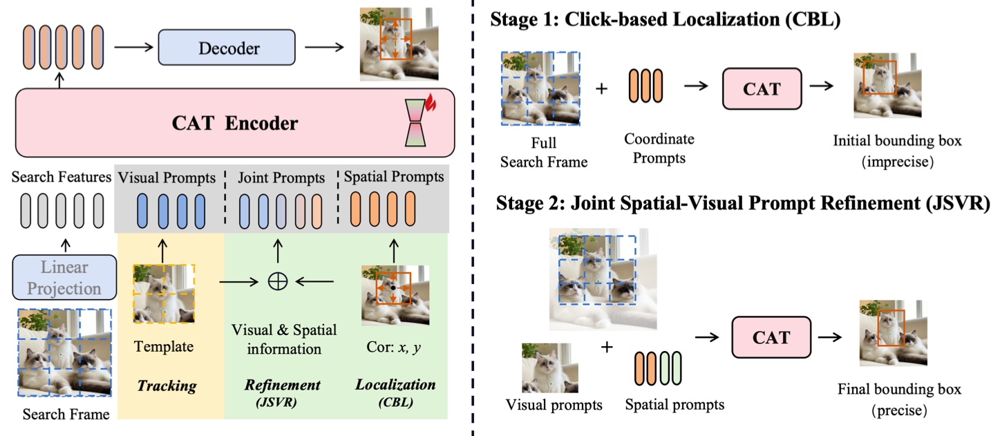

# CAT: A Unified Click-and-Track Framework for Realistic Tracking

Official implementation of **CAT (Click-And-Track)**.（The code is being gradually updated. Stay tuned.）

CAT introduces a realistic visual tracking paradigm where the target can be initialized by **a single click** instead of a precise bounding box. This greatly simplifies human interaction and better reflects real-world applications such as robotics, UAV tracking, and surveillance.

📄 [Paper](https://openaccess.thecvf.com/content/ICCV2025/papers/Yuan_CAT_A_Unified_Click-and-Track_Framework_for_Realistic_Tracking_ICCV_2025_paper.pdf)
: *CAT: A Unified Click-and-Track Framework for Realistic Tracking*, ICCV 2025
---

## Overview

Most existing trackers assume a **precisely annotated bounding box** for initialization. However, drawing accurate bounding boxes is slow and impractical in many real-world scenarios.

CAT proposes a **unified click-based tracking framework** that enables reliable object tracking from only a **single user click**. The method bridges the gap between minimal user interaction and accurate target localization by introducing a click-based localization module, a spatial-visual prompt refinement mechanism, and a parameter-efficient mixture-of-experts adaptation.

---

## Framework

CAT consists of three key components:

- **Click-based Localization (CBL)**  
  Localizes the target from a single click by performing global search over the image.

- **Joint Spatial-Visual Prompt Refinement (JSVR)**  
  Refines the initial localization by jointly leveraging spatial and visual prompts.

- **CTMoE (Click-Tracking Mixture-of-Experts)**  
  A parameter-efficient module that adapts a frozen foundation tracker to click-based tracking.

---

## Highlights

- Realistic **single-click target initialization**
- Unified **click-and-track framework**
- Parameter-efficient adaptation via **Mixture-of-Experts**
- Compatible with modern **foundation trackers**

---

## Benchmarks

CAT is evaluated on multiple tracking benchmarks including:

- LaSOT
- LaSOText
- TrackingNet
- GOT-10k
- UAV123
- UAVTrack112
- DTB70

The method significantly reduces the performance gap between **click-based initialization** and traditional **bounding-box initialization**.

---

## Citation

If you find this work useful for your research, please consider citing:

```bibtex
@InProceedings{Yuan_2025_ICCV,
    author    = {Yuan, Yongsheng and Zhao, Jie and Wang, Dong and Lu, Huchuan},
    title     = {CAT: A Unified Click-and-Track Framework for Realistic Tracking},
    booktitle = {Proceedings of the IEEE/CVF International Conference on Computer Vision (ICCV)},
    month     = {October},
    year      = {2025},
    pages     = {5690-5700}
}
```

---

## License

This project is released for academic research purposes only.
